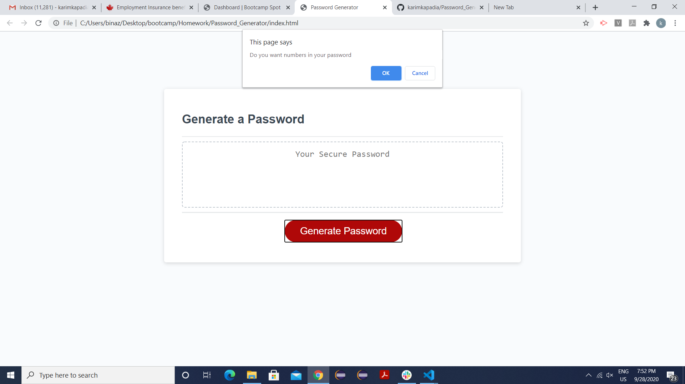
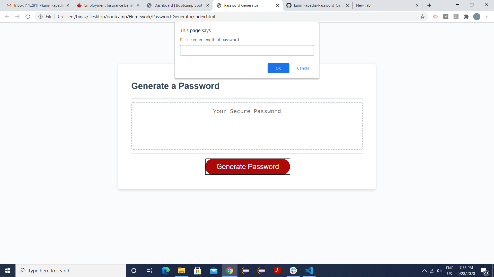
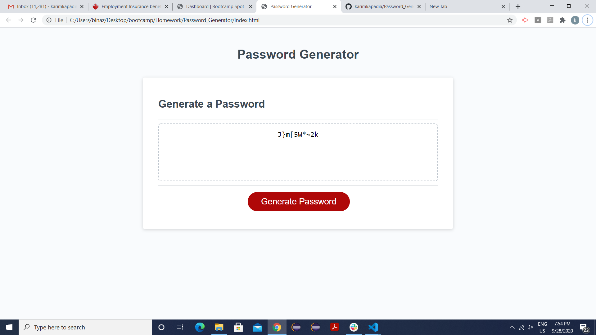
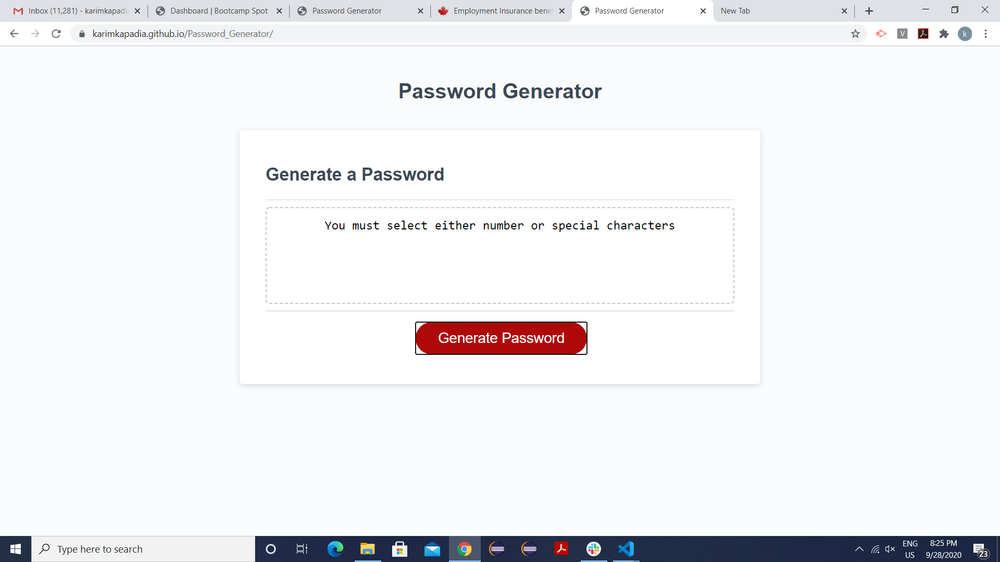

# Password_Generator
This is a simple webpage for user defined password generator. To create this web page I used multiple confirm button which take user input for criteria they want in their password.If user declines all the confirm boxes then there will error displayed that 'Password cannot be blank'. As per the acceptance criteria there was limit for minimum character which is 8 and maximum limit of 128 characters. Hence if user try to violet minimum and maximum character limit then it will show error message that 'Passowrd has to be minimum 8 and maximum of 128 characters'. If user is not choosing either number or special characters in their password then there will be error message 'You must select either number or special characters'. If user is not choosing either capital or small letters in their criteria then there will error message'' 

# Screen shot of each criteria for password, error message for blank and  min & max length of password and result.

# Links
Repository: https://github.com/karimkapadia/Password_Generator
Live Link:  https://karimkapadia.github.io/Password_Generator/

